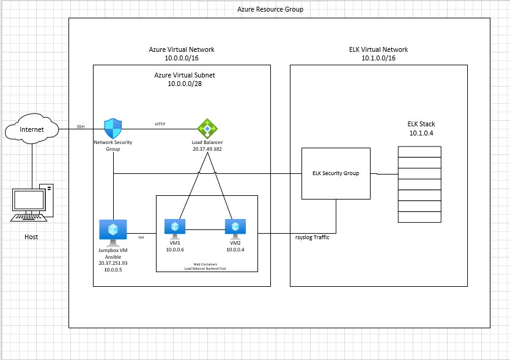

## Automated ELK Stack Deployment

The files in this repository were used to configure the network depicted below.

These files have been tested and used to generate a live ELK deployment on Azure. They can be used to either recreate the entire deployment pictured above. Alternatively, select portions of the provided yml files may be used to install only certain pieces of it, such as Filebeat.

This document contains the following details:
- Description of the Topology
- Access Policies
- ELK Configuration
  - Beats in Use
  - Machines Being Monitored
- How to Use the Ansible Build

### Description of the Topology

The main purpose of this network is to expose a load-balanced and monitored instance of DVWA, the D*mn Vulnerable Web Application.

Load balancing ensures that the application will be highly avalible, in addition to restricting access to the network.

Integrating an ELK server allows users to easily monitor the vulnerable VMs for changes to the application and system server.

The configuration details of each machine may be found below.

| Name      | Function       | IP Address | Operating System |
|-----------|----------------|------------|------------------|
| JumpBox   | Gateway        | 10.0.0.5   | Ubuntu           |
| VM1       | Webserver      | 10.0.0.6   | Ubuntu           |
| VM2       | Webserver      | 10.0.0.4   | Ubuntu           |
| Elk Stack | System Logging | 10.1.0.4   | Ubuntu           |

### Access Policies

The machines on the internal network are not exposed to the public Internet. 

Only the Jump Box machine can accept connections from the Internet. Access to this machine is only allowed from my own IP address

Machines within the network can only be accessed by the JumpBox VM (10.0.0.5).

A summary of the access policies in place can be found in the table below.

| Name      | Accessibility                                    | Whitelisted IP Addresses                                   |
|-----------|--------------------------------------------------|------------------------------------------------------------|
| JumpBox   | Public (Port 22 access with appropriate ssh key) | 10.0.0.4, 10.0.0.6, 10.1.0.4, 20.37.49.182, Workstation IP |
| VM1       | Private                                          | 10.0.0.4, 10.0.0.5, 20.37.49.182, Workstation IP           |
| VM2       | Private                                          | 10.0.0.5, 10.0.0.6, 20.37.49.182, Workstation IP           |
| Elk Stack | Private                                          | 10.0.0.4, 10.0.0.5, 10.0.0.6, Workstation IP               |

### Elk Configuration

Ansible was used to automate configuration of the ELK machine. No configuration was performed manually, which is advantageous because the same results can be replicated across multiple machines with very little effort. Automation removes the need to manually configure each machine and saves time.

The playbooks implements the following tasks:
- Installs docker
- Installs python
- Allocates more memory to the Elk Stack
- Downloads and launches the Elk container

The result of running `docker ps` after successfully configuring the ELK instance should read something along the lines of:

sysadmin@elk:~$ sudo docker ps

CONTAINER ID        IMAGE               COMMAND                  CREATED             STATUS              PORTS                                                                              
NAMES
842caa422ed8        sebp/elk            "/usr/local/bin/star…"   3 hours ago         Up 3 hours          0.0.0.0:5044->5044/tcp, 0.0.0.0:5601->5601/tcp, 0.0.0.0:9200->9200/tcp, 9300/tcp   elk
sysadmin@elk:~$

### Target Machines & Beats
This ELK server is configured to monitor the following machines: 10.0.0.6 (VM1), 10.0.0.4 (VM2)

We have installed the following Beats on these machines:
Filebeat, on VM1 and VM2
Metricbeat on VM1 and VM2

Filebeat moniters and collects system logs from the Web VMs. These logs events are exported to our instance of Kibana.

Metricbeat collects metrics from the operating system and from services running on the server. These metrics are also exported to our instance of Kibana.

### Using the Playbook
In order to use the playbook, you will need to have an Ansible control node already configured. Assuming you have such a control node provisioned: 

SSH into the control node and follow the steps below:
- Copy the Install-Elk file to the ansible container.
- Update the conf file to include the correct hosts, usernames and IPs
- Run the playbook, and navigate to the target machines to check that the installation worked as expected. Navigate to http://[Your IP]:5601/app/kibana#/home
